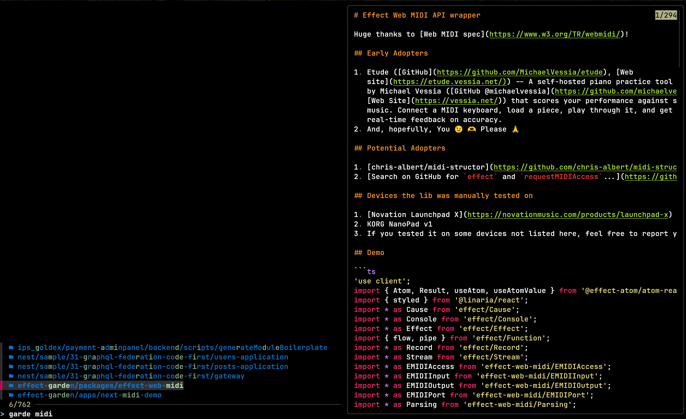
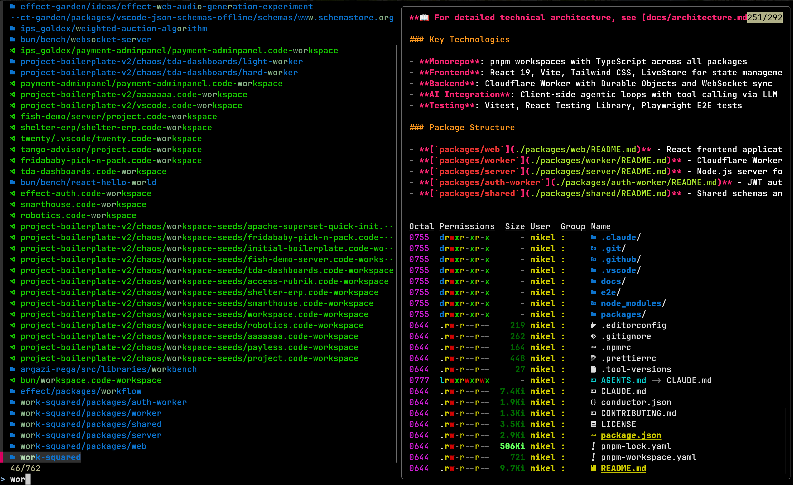

# qcode-effect-v4

A keyboard-shortcut-triggered fuzzy project opener for VS Code. It recursively
scans `~/projects` for project roots (detected via `.git`, `.vscode`,
`package.json`, `mise.toml`, or `.code-workspace` files) while skipping noisy
dirs like `node_modules`, `dist`, etc. The results are piped into `fzf` with a
live preview panel that shows the project's README (via `bat`) and a rich
directory listing (via `eza`). Selecting an entry opens it in VS Code.

**Runtime dependencies:** `fzf`, `eza`, `bat`. Optionally `bfs` for faster
directory traversal (falls back to `find`).

To install only `node_module` deps (the binaries from above must be present):

```bash
bun install
```

To use:
```bash
# I assigned a keybinding in GNOME to ctrl+alt+r
kitty --single-instance /home/nikel/.local/share/mise/installs/bun/latest/bin/bun /home/nikel/projects/qcode-effect-v4/dist/minified/index.js

# or a shorter version if you want to see the result without build step
bun index.ts
```

Running the bundled and minified version produces the fastest startup times.

Build and minify with `bun run build`

## Demo

|  |  |
| ---------------------- | ---------------------- |
